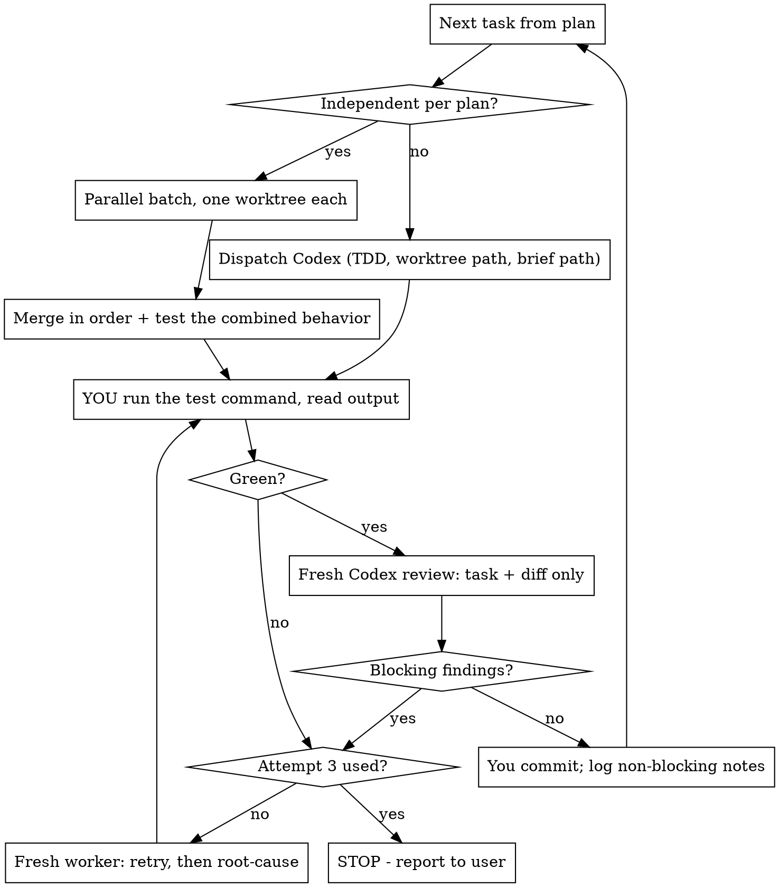

# Codex-Orchestrated Plan Execution

## Overview

The Superpowers subagent-driven-development workflow stays exactly as it is — its state
machine, role separation, TDD gate, and review gate. **Codex replaces the workers, not the
process.**

**Core principle: you are the controller. You dispatch, gate, and commit. You never write
implementation code yourself.**

Applies to a fresh execution and to continuing an execution begun in a previous session.

## Setup — Once, At The Start

1. Run `codex:setup` to confirm the local Codex CLI is actually usable. If it is not
   available: say so plainly and fall back to normal Superpowers subagents for the whole
   execution. Do not stall, and do not silently start writing the code yourself.

2. Produce an execution brief at `docs/plans/<plan-name>-brief.md`. Every Codex dispatch is
   a cold start; without a brief each worker rediscovers the same facts, and rule 6 makes
   that worse by sending paths instead of contents. Write it once, pass its path to every
   worker. It contains the test command and the single-test command, build and lint
   commands, a module/directory map, and local conventions not obvious from one file.

   Gathering this is read-only research — dispatch `Explore`, not Codex. Then run the test
   and build commands yourself before any worker relies on them.

   A stale brief is a live failure mode: it can burn a task's entire attempt budget while
   looking like a worker problem. Re-verify it when the build changes, and suspect it first
   when two independent workers fail identically.

3. On resume from a previous session: re-read the plan and the brief, check which tasks are
   already committed, and re-run the test suite to establish the current state before
   dispatching anything.

## The Twelve Rules

1. Controller only. You orchestrate. You do not write implementation code.

2. Codex does the work. Every implementation, review, and debugging task the Superpowers
   workflow would delegate to a subagent goes to Codex via the `codex:codex-rescue`
   subagent. Read-only research/exploration may go to `Explore` instead — it is better
   suited to that.

3. Process is preserved. Follow `superpowers:subagent-driven-development` — its state
   machine, role separation, and gates — unchanged.

4. Foreground. Run every Codex SDD delegation synchronously (`run_in_background: false`) so
   the result is in hand before the state machine advances. The one permitted concurrency
   is review-alongside-implementation, since review is read-only: freely within an
   already-independent batch, and in a serial chain only when the next task passes rule 5's
   independence test — hold its diff uncommitted if the earlier review comes back blocking.
   Dispatch any overlap as one message and await the batch. Do not generalize this into an
   async state machine.

5. Parallelism only when the plan says so. Run tasks in parallel only where the plan
   declares them independent, or where they touch provably disjoint files. Never on your
   own guess. Everything else is serial. Dispatch a parallel batch in one message and await
   the whole batch before advancing. Each parallel worker gets its own worktree —
   concurrent Codex workers in a shared tree clobber each other. Merge back in a
   deterministic order.

   Merging is its own gate, not a formality. Each worktree was green with only its own
   change, so the merged code has never been tested: the merge dispatch must add a test
   exercising the merged behaviors *together*, not just re-run what already passed. Dispatch
   a fresh Codex worker for any conflict whose resolution could change behavior; resolve
   yourself only what cannot (lockfiles, import ordering, changelog entries). Repeated
   semantic conflicts mean the plan's independence claim was wrong — serialize what remains
   and say so.

6. Minimum sufficient context. Give each worker only what its role needs. Prefer file paths
   over pasting plan text, diffs, or history. Always pass the execution brief path. Codex
   does not inherit your cwd — pass the worktree path explicitly in the prompt.

7. TDD in every prompt. Every delegation prompt states: failing test first, then
   implementation. Omit this and Codex writes implementation-first — the workflow keeps its
   shape but loses its guarantee.

8. Review is a separate clean context, and its findings are graded. Code review is its own
   `codex:codex-rescue` dispatch, given only the plan task and the diff, with no
   implementation history. The worker that wrote a diff never reviews it. The review prompt
   must classify every finding as blocking (incorrect behavior, deviation from the plan
   task, missing or fake test, TDD violation, security or data-loss risk) or non-blocking
   (naming, style, optional refactor). Only blocking findings send the task back; record the
   rest for branch close.

9. You own git, and you verify before you commit. You are authorized to create and use
   isolated worktrees without asking, including one per worker for parallel batches. Before
   each commit you run the test command yourself and read the output — a worker's report
   that tests pass is a claim, not evidence. You commit, not Codex. Close out via
   `superpowers:finishing-a-development-branch`.

10. Continue autonomously; three attempts, honestly counted. Move between tasks without
    checking in. Stop only for: a genuine blocker, a plan contradiction requiring the user's
    decision, completion, or 3 failed attempts on one task. A failed attempt is a red test
    suite or a blocking review finding — never a non-blocking one. Each attempt is a fresh
    worker carrying what previous attempts *eliminated*, not just the last error text.
    Attempt 3 is a root-cause investigation under `superpowers:systematic-debugging`, not
    another patch.

    The budget leaks unless you hold it: a diagnosis-only dispatch still consumes its
    attempt, and finishing a diagnosis does not buy a fourth try. The single exception is a
    failure traced to your own error — a wrong brief, a malformed dispatch. That does not
    consume an attempt, and when you claim it you must say so explicitly rather than
    quietly resetting the count.

11. Verify Codex once (setup step 1) and fall back rather than stall.

12. No completion claim without test evidence. Per
    `superpowers:verification-before-completion` — you run the command, you read the
    output, then you speak.

## Per-Task Loop

## Red Flags — STOP

| Thought | Reality |
|---|---|
| "Diagnosis isn't really an attempt" | It is. Finishing a diagnosis does not buy a fourth try. Rule 10. |
| "That failure was my fault, so it doesn't count" | Only if you name it as controller error out loud. Silent resets are how three becomes five. |
| "Attempt 3, same fix but more careful" | Attempt 3 is a root-cause investigation, not another patch. |
| "Both worktrees were green, the merge is fine" | Neither ran the merged code. Test the combined behavior. Rule 5. |
| "This merge conflict is small, I'll just fix it" | If the fix could change behavior, it is implementation. Dispatch it. |
| "Codex says the tests pass, that's good enough" | A claim is not evidence. Run them yourself. Rule 9. |
| "The reviewer wants a rename, back to Codex" | Non-blocking. Log it, move on. It costs no retry. Rule 8. |
| "This edit is one line, faster if I just do it" | Rule 1 has no size exemption. Dispatch it. |
| "These two tasks obviously don't overlap" | "Obviously" is your guess. Only the plan or provably disjoint files authorize parallel. |
| "One worktree is fine, they'll take turns" | They won't. Concurrent Codex workers clobber a shared tree. |
| "I'll background these to save wall-clock" | Foreground, except the review overlap in rule 4. |
| "The implementer knows the code best, let it review" | That is why it can't review. Fresh context, diff only. |
| "Two workers failed the same way, the code must be cursed" | Suspect the brief and the wiring before the logic. Identical failures rarely mean two bad implementations. |
| "Skip the brief, the repo is small" | Small repo, fifteen cold starts. Write it once. |
| "TDD is implied, the prompt is long enough" | State it explicitly in every prompt or you get implementation-first. |

## Quick Reference

| Concern | Answer |
|---|---|
| Who writes code | `codex:codex-rescue` |
| Who explores/researches | `Explore` (read-only) — including the execution brief |
| Who reviews | fresh `codex:codex-rescue`, task + diff only, findings graded |
| Who runs tests | you, before every commit — not Codex's word for it |
| Who resolves merge conflicts | Codex, if resolution could change behavior; you otherwise |
| Background? | no — except the review overlap in rule 4 |
| Worktrees | one per parallel worker; create without asking |
| cwd | not inherited — pass worktree path in prompt |
| Every prompt carries | worktree path, brief path, TDD instruction |
| Retry limit | 3, diagnosis included. Blocking findings only. Attempt 3 = root cause. |
| Finish | `superpowers:finishing-a-development-branch` |
